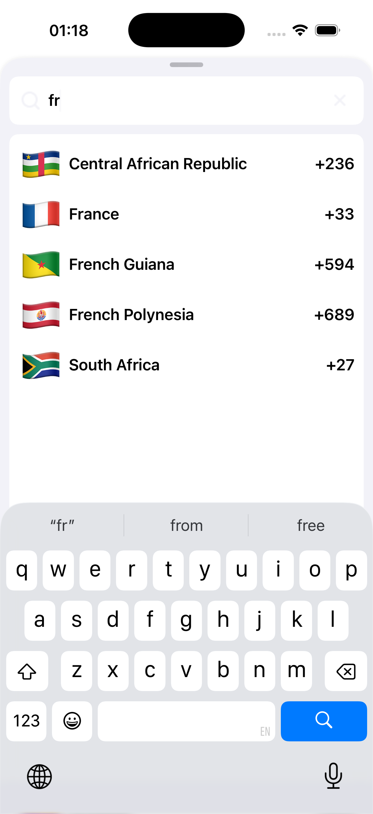
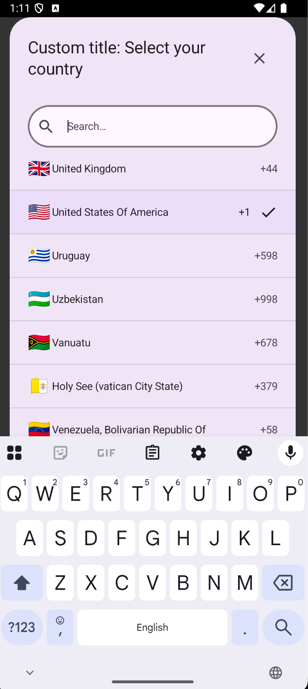

# react-native-nitro-country-picker

A Promise-based, native country picker for React Native, powered by Nitro Modules.

[](https://www.npmjs.com/package/react-native-nitro-country-picker)
[](https://www.npmjs.com/package/react-native-nitro-country-picker)
[](https://reactnative.dev/docs/the-new-architecture/landing-page)
[](https://www.typescriptlang.org/)
[](LICENSE)
[](https://developer.apple.com/ios/)
[](https://developer.android.com/)
[](https://nitro.margelo.com/)

| Preview 1                                                                    | Preview 2                                                                            |
| ---------------------------------------------------------------------------- | ------------------------------------------------------------------------------------ |
|  |  |

This library provides a single async API that opens a native picker and returns structured country data.

I created this library because I kept running into cases where I needed to implement a country code picker. There are several options, but they are either JS-only solutions with a declarative API (often with poor performance) or noticeably laggy.

All I wanted was a module with a single `pickCountry` method that returns country data. Done. No hassle. The UI should include a list and a simple search bar. It can be customized, but for now it should stay as simple as possible.

- Android native implementation: [CountryCodePickerCompose](https://github.com/ahmmedrejowan/CountryCodePickerCompose)
- iOS native implementation: [CountryPickerAKS](https://github.com/aksamitsah/CountryPickerAKS)

---

## Requirements

| Platform | Minimum |
| -------- | ------- |
| iOS      | 15.1+   |
| Android  | API 24+ |

> Note: This package depends on [react-native-nitro-modules](https://nitro.margelo.com/).

---

## Features

- 📱 **Native UI**: Uses native picker interfaces on both iOS and Android.
- ⚡ **Promise-Based API**: Call `pickCountry(options?)` and await the result.
- 🔷 **Typed Return Data**: Returns a typed object with `name`, `dialCode`, and `code`.
- 🧭 **Dismiss Handling**: Resolves to `null` when the picker is dismissed or canceled.
- 🧠 **Last Selection Cache**: Read the last picked country with `getLastPickedCountry()`.
- 🎛️ **Configurable Title**: Supports `headerTitle` (currently applied on Android).
- 🧩 **Nitro Module Powered**: Built with `react-native-nitro-modules` for native performance.

---

## Installation

```bash
npm install react-native-nitro-country-picker react-native-nitro-modules
```

or

```bash
yarn add react-native-nitro-country-picker react-native-nitro-modules
```

or

```bash
pnpm add react-native-nitro-country-picker react-native-nitro-modules
```

### iOS Setup

```bash
cd ios && pod install
```

### Android Setup

No additional configuration is required for Android. Autolinking handles the native module setup.

---

## Usage

```tsx
import { pickCountry } from 'react-native-nitro-country-picker';

const country = await pickCountry();
```

### With options

```tsx
import { pickCountry } from 'react-native-nitro-country-picker';

const country = await pickCountry({
  headerTitle: 'Select your country',
});
```

---

## Returned Data Examples

### 1) Handle selected vs dismissed

```tsx
import { pickCountry } from 'react-native-nitro-country-picker';

const picked = await pickCountry();

if (picked) {
  console.log('Country name:', picked.name);
  console.log('Dial code:', picked.dialCode);
  console.log('ISO code:', picked.code);
} else {
  console.log('Picker dismissed without selection');
}
```

### 2) Build display text from returned data

```tsx
import { pickCountry } from 'react-native-nitro-country-picker';

const picked = await pickCountry();
const label = picked
  ? `${picked.name} (${picked.dialCode}, ${picked.code})`
  : 'No country selected';

console.log(label);
```

### 3) Read last picked country

```tsx
import {
  getLastPickedCountry,
  pickCountry,
} from 'react-native-nitro-country-picker';

await pickCountry();

const last = getLastPickedCountry();
if (last) {
  console.log('Last picked:', last.name, last.dialCode, last.code);
}
```

---

## API

### `pickCountry(options?) => Promise<IPickedCountry | null>`

Opens the native picker and resolves with:

- `IPickedCountry` when user selects a country
- `null` when user dismisses/cancels

Options:

- `headerTitle?: string`

### `getLastPickedCountry() => IPickedCountry | null`

Returns the most recent selected country for the current app runtime session.

---

## Type Shapes

```ts
type IPickedCountry = {
  name: string;
  dialCode: string;
  code: string;
};

type PickCountryOptions = {
  headerTitle?: string;
};
```

---

## Example App

To run the included example app:

```bash
cd example
pnpm install
pnpm ios
# or
pnpm android
```

---

## Contributing

See [CONTRIBUTING.md](CONTRIBUTING.md) for development workflow and contribution guidelines.

---

## License

MIT

---

Made with [create-react-native-library](https://github.com/callstack/react-native-builder-bob)
